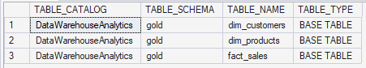
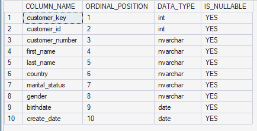
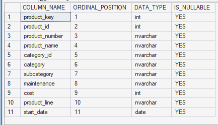
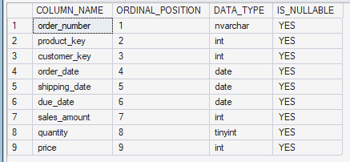

# TABLES EXPLORATION
This section establishes an understanding of the database structure before conducting the detailed analysis. The objective is to identify the available tables, understand their roles, and examine their column structures, data types, and nullability.

Understanding the database structure provides the foundation for correctly joining and analysing customer, product, and sales data.


## Exploring Database Tables
The objective is to identify the tables available within the database and determine which tables serve as the primary sources for customer, product, and sales analysis.

### Query
```sql
SELECT * FROM INFORMATION_SCHEMA.TABLES;
```

### Query Result



### key Insight
The database uses a gold schema containing three core analytical tables:
1. `dim_customers` — customer information
2. `dim_products` — product information
3. `fact_sales` — sales transaction information

The structure follows a star-schema design, providing a suitable foundation for analysing sales performance from customer, product, and transaction perspectives.


## Customers Table
The objective is to examine the structure of the dim_customers table to understand the available customer attributes, their data types, and whether the fields permit missing values.

### Query
```SQL
SELECT 
    COLUMN_NAME,
    ORDINAL_POSITION,
    DATA_TYPE,
    IS_NULLABLE
FROM INFORMATION_SCHEMA.COLUMNS
WHERE TABLE_NAME = 'dim_customers';
```

### Query Result



### Key insight
The `dim_customers` table contains 10 fields covering customer identification, demographic information, location, and relevant dates.

All identified columns allow `NULL` values. This highlights the need to consider missing or unspecified customer attributes during subsequent data-quality and demographic analyses.

Understanding the availability and completeness of customer attributes is important because missing demographic or location information can affect customer segmentation, geographic analysis, and the interpretation of sales patterns.


## Products Table
The objective is to examine the structure of the `dim_products` table to understand the product attributes available for product and category-level analysis.

### Query
```sql
SELECT 
    COLUMN_NAME,
    ORDINAL_POSITION,
    DATA_TYPE,
    IS_NULLABLE
FROM INFORMATION_SCHEMA.COLUMNS
WHERE TABLE_NAME = 'dim_products';
```

### Query Result



### Key Insights
The `dim_products` table contains 11 fields covering product identification, classification, maintenance, cost, and lifecycle dates, with all columns allowing `NULL` values, indicating that missing product attributes should be considered when performing product, category, cost, and lifecycle analysis.

Understanding the available product attributes establishes the foundation for evaluating product performance, category contribution, product costs, and other product-related business metrics.


## Sales Table
The objective is to examine the structure of the `fact_sales` table to understand the fields available for transaction-level sales analysis.

### Query
```sql
SELECT 
    COLUMN_NAME,
    ORDINAL_POSITION,
    DATA_TYPE,
    IS_NULLABLE
FROM INFORMATION_SCHEMA.COLUMNS
WHERE TABLE_NAME = 'fact_sales';
```


### Query Result



### Key Insights
The `fact_sales` table captures transaction details, linking products and customers with order dates, delivery dates, sales amounts, quantities, and prices.

It provides the primary measures required for analysing sales volume, revenue, customer purchasing activity, product performance, and geographic sales performance.

The table also serves as the central source for the project's quantitative analysis. Its transaction-level measures can be combined with customer and product attributes to evaluate **what was sold, to whom, where it was sold, and how much revenue it generated**.
