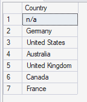
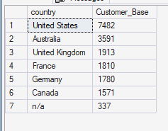
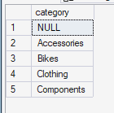
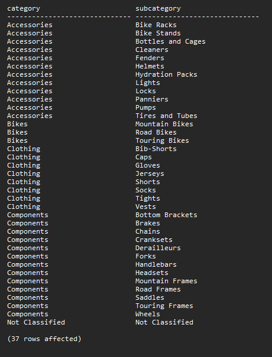
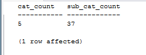

# Dimensions Exploration
Dimensions exploration examines the unique values and distributions within the customer and product dimensions. The objective is to understand the available geographic and product classifications, identify the structure of the data, and highlight missing or unclassified attributes that may affect subsequent analysis.

## Unique countries
The objective is to identify the distinct countries represented in the customer dimension to understand the geographic scope of the dataset and identify any missing or unspecified country information.

### Query
```sql
SELECT 
    DISTINCT Country
FROM gold.dim_customers;
```


### Query Result



### Key Insight
Customers are represented across **six identified countries**, with `n/a` appearing as an additional value for customers whose country information is missing or unspecified.

This establishes the geographic scope of the customer base and highlights missing country information that should be considered during data-quality assessment.


## Customer_Base per country
The objective is to measure the number of customers in each country to understand the geographic distribution of the customer base and identify the markets with the largest customer populations.

### Query
```sql
SELECT
    country,
    count(customer_id) AS Customer_Base
FROM gold.dim_customers
GROUP BY country
ORDER BY count(customer_id) DESC;
```

### Query Result



### Key Insight
The United States has the largest customer base, with **7,482 customers (approximately 40%), followed by Australia with 3,591 customers (approximately 19%). Canada has the smallest identified customer base, with 1,571 customers (approximately 9%)**.

There are also **337 n/a** customer records, representing customers without an identified country.

The concentration of customers in the United States and Australia indicates that these markets are particularly important to the company's customer base.


## Unique Product Categories
The objective is to unearth the distinct product categories available in the product dimension to understand the structure of the product portfolio and establish the categories used in subsequent product-performance analysis.

### Query
```sql
SELECT 
    Distinct category
FROM gold.dim_products;
```


### Query Result



### Key Insight
The product catalog contains **four identified categories: Bikes, Components, Accessories, and Clothing**.

**A NULL category** is also present, indicating product records without an assigned category.

The identified categories provide the foundation for comparing product performance and revenue contribution across different areas of the product portfolio. The unclassified records should be investigated because missing category information can affect category-level reporting.


## Unique Product Categories and Sub-categories
The objective is to identify the unique category and subcategory combinations within the product catalog to understand the product hierarchy and the level of detail available for product analysis.

### Query
```sql
SELECT DISTINCT
    COALESCE(category, 'Not Classified') AS category,
    COALESCE(subcategory, 'Not Classified') AS subcategory
FROM gold.dim_products
ORDER BY category, subcategory;


SELECT 
    COUNT(DISTINCT COALESCE(category, 'Not Classified')) AS category_count,
    COUNT(DISTINCT COALESCE(subcategory, 'Not Classified')) AS subcategory_count
FROM gold.dim_products;
```


### Query Result




### Key Insight
The product catalog contains **four classified product categories and 36 subcategories**. Missing category and subcategory values have been explicitly grouped as **“Not Classified”** to prevent NULL values from being overlooked during analysis. This provides a more complete view of the product hierarchy while highlighting records that may require data-quality remediation.

Accurate product classification is important for reliable category-level reporting, product performance evaluation, and inventory planning. The business should investigate and resolve “Not Classified” product records where possible


## Section Summary

The dimensions exploration establishes the key geographic and product structures used throughout the analysis. The customer dimension shows a customer base concentrated primarily in the United States and Australia, while the product dimension provides four main categories and a more detailed subcategory structure.

The analysis also identifies missing or unclassified values in both customer and product attributes. These findings provide an important data-quality context for the subsequent sales, customer, product, and revenue analyses.
