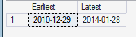
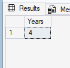
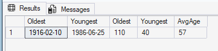

# Date Exploration
This section examines the temporal coverage of the sales dataset and the age profile of the customer base. The objective is to `establish the period available for sales analysis, understand the dataset's historical coverage, and identify potential age-related data-quality issues`.


## Earliest and latest dates in the dataset
The objective is to identify the earliest and latest sales transaction dates to establish the historical period covered by the dataset.


### Query
```sql
SELECT
    min(order_date) as Earliest,
    max(order_date) as Latest
FROM gold.fact_sales;
```


### Query Result



### Key Insight
The sales data covers the period from **29 December 2010 to 28 January 2014**, providing just over three years of transaction history.

This period provides a useful foundation for examining sales performance across multiple calendar years and identifying longer-term patterns.


## Date Range of the Dataset (Time range)
The objective is to calculate the difference between the earliest and latest transaction dates and understand how `SQL Server's DATEDIFF(YEAR) function` interprets the period.

### Query
```sql
SELECT
    DATEDIFF(YEAR, MIN(order_date), MAX(order_date)) as Years
FROM gold.fact_sales;
```

### Query Result



### Key Insight
The query returns `4 years`, but this does not represent four complete years of sales data. **SQL Server's DATEDIFF(YEAR) counts the number of calendar-year boundaries crossed between the two dates**.

Therefore, `although the function returns 4, the actual sales period extends from 29 December 2010 to 28 January 2014, representing just over three years of transaction history`.

When measuring elapsed time, `DATEDIFF(YEAR)` should not be interpreted as the number of complete years between two dates. This distinction is important when calculating historical coverage and year-based business metrics.


## Customer Age Profile (Youngest and Oldest Customer's Birthdate)
The objective is to examine the age profile of customers and identify unusually high or low age values that may require further data-quality investigation.

### Query
```sql
SELECT
    MIN(birthdate) as Oldest_birthdate,
    MAX(birthdate) as Youngest_birthdate,
    DATEDIFF(YEAR, MIN(birthdate),GETDATE()) as Oldest_Age,
    DATEDIFF(YEAR, MAX(birthdate), GETDATE()) as Youngest_Age,
    AVG(DATEDIFF(YEAR, birthdate, GETDATE())) as AvgAge
FROM gold.dim_customers;
```


### Query result



### Key Insight
The calculated customer ages range from approximately **40 to 110 years**, with an average age of approximately **57 years**.

The maximum calculated age of 110 years is unusually high relative to the overall customer population and should be investigated as a `potential data-quality issue or outlier rather than automatically treated as an error.`

The age calculation uses the current date (GETDATE()), meaning the results represent customers' approximate current ages rather than their ages at the time of purchase. This distinction should be considered when interpreting demographic findings.