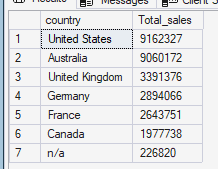
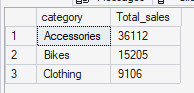
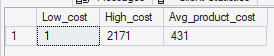
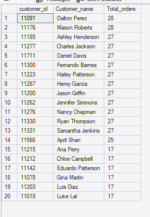

# MAGNITUDE ANALYSIS 
Magnitude analysis examines the scale of business activity across key dimensions to identify where sales volume, revenue, product costs, and customer purchasing activity are concentrated.

The analysis answers four business questions:
1. Which countries generate the most sales revenue?
2. Which product categories generate the highest sales volume?
3. How widely do product costs vary?
4. Which customers demonstrate the highest purchasing frequency?


## Total Sales by Country 
`Which countries generate the highest sales revenue?`

The goal is to measures sales revenue across customer locations to identify the markets contributing most to overall sales.


### Query
```sql 
SELECT
    c.country,
    sum(s.sales_amount) as Total_sales
FROM gold.fact_sales s 
INNER JOIN gold.dim_customers c 
    ON s.customer_key = c.customer_key
GROUP BY c.country
ORDER BY sum(s.sales_amount) DESC;
```


### Query Result



### Key Insight
The United States and Australia are the strongest markets, generating approximately **9.16M and 9.06M** in sales respectively. The n/a customer-location group contributes only about **0.23M**, indicating that most sales can be associated with identified customer locations.

The company should prioritize the United States and Australia for revenue-generating activities, including inventory availability, marketing investment, and customer retention.


## Total sales by Product Categories
`Which product categories generate the highest sales volume?`

This section measures sales volume across product categories to determine which categories contribute most to unit demand.


### Query
```sql
SELECT
    p.category,
    sum(s.quantity) as Total_sales
FROM gold.fact_sales s 
INNER JOIN gold.dim_products p 
    ON s.product_key = p.product_key
GROUP BY p.category
ORDER BY sum(s.quantity) DESC;
```


### Query result



### Key Insight
Accessories lead sales volume with **36,112 units**, followed by Bikes with **15,205 units** and Clothing with **9,106 units**. Accessories therefore represent the largest source of unit sales in the dataset.

The company should maintain strong availability of accessories because of their high unit demand.


## Average, Minimum & Maximum Product cost
`How widely do product costs vary across the product portfolio?`

The objective is to understand the range and average level of product costs to identify the overall cost structure of the product portfolio.


### Query
```sql
SELECT 
    MIN(cost) as Low_cost,
    MAX(cost) as High_cost,
    AVG(cost) as Avg_product_cost
FROM gold.dim_products;
```


### Query result



### Key Insight
Product costs range from **1 to 2,171**, with an average cost of approximately **431**. The substantial difference between the minimum and maximum values indicates a broad range of product costs across the portfolio.

The company should avoid applying a single pricing, inventory, or margin strategy across all products. **Low-cost and high-cost products require different inventory, pricing, and profitability considerations**.


## Total Orders by customers
`Which customers place the highest number of distinct orders?`

The goal is to identify customers with the highest purchasing frequency to understand repeat-purchase behavior and potential loyalty segments.

### Query
```sql
SELECT 
    TOP 20
    c.customer_id,
    concat(c.first_name, ' ', c.last_name) Customer_name,
    count(DISTINCT order_number) as Total_orders
FROM gold.fact_sales s 
INNER JOIN gold.dim_customers c 
    ON s. customer_key = c.customer_key
GROUP BY c.customer_id, concat(c.first_name, ' ', c.last_name)
ORDER BY count(DISTINCT order_number) DESC;
```


### Query Result



### Key Insight
The analysis was limited to the **top 20 customers** for concise presentation. These customers recorded between **17 and 28 distinct orders**, highlighting a group of highly active repeat customers suitable for `potential retention and loyalty targets`.

The company should consider targeted loyalty initiatives, personalized offers, and proactive retention strategies for highly active customers.


## Key Business Takeaways

`Magnitude analysis reveals four important patterns`:

1. Geographic concentration: The United States and Australia are the strongest revenue-generating markets.
2. Volume concentration: Accessories generate the highest unit sales volume.
3. Broad product cost structure: Product costs vary considerably, indicating different product segments requiring different commercial strategies.
4. Repeat purchasing: A group of highly active customers places significantly more orders than typical customers and represents an opportunity for retention and loyalty initiatives.
