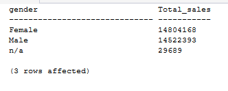
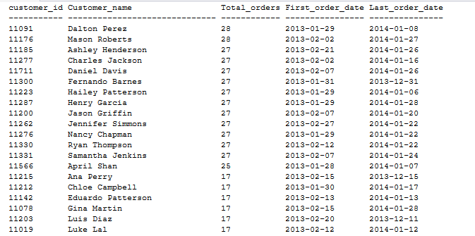

# CUSTOMER ANALYSIS
Customer analysis examines sales behavior across key customer demographic attributes to understand how revenue is distributed across different customer groups.

The analysis focuses on two demographic dimensions: **gender and marital status**.

These comparisons help determine whether sales are concentrated within particular customer groups and provide a basis for subsequent customer segmentation and marketing analysis.


## Total Sales by Gender
`How is sales revenue distributed by customer gender?`

This enables an understanding of how sales revenue is distributed between male and female customers.


### Query
```sql
SELECT 
    c.gender,
    sum(s.sales_amount) as Total_sales
FROM gold.fact_sales s 
INNER JOIN gold.dim_customers c 
    ON s. customer_key = c.customer_key 
GROUP BY c.gender
ORDER BY Total_customers DESC;
```


### Query Result



### Key Insight
Sales are almost evenly distributed by gender. Female customers generated approximately **14.80M (50.5%)**, while male customers generated approximately **14.52M (49.5%)**. The `n/a` group contributes only about 29,689, indicating that missing gender information has minimal impact on the overall sales comparison.


## Total Sales by Marital Status
`Does sales revenue differ substantially between married and single customers?`

The objective is to understand how sales revenue is distributed between customers based on marital status.


### Query
```sql
SELECT 
    c.marital_status,
    sum(s.sales_amount) as Total_sales
FROM gold.fact_sales s 
INNER JOIN gold.dim_customers c 
    ON s. customer_key = c.customer_key
GROUP BY c.marital_status
ORDER BY sum(s.sales_amount) DESC;
```


### Query Result


### Key Insight
Married customers generated **15.19M (~51.7%)** in total sales, slightly exceeding **single customers at 14.17M (~48.3%)**. The relatively small **3.4 percentage-point difference** indicates that sales are fairly balanced across the two marital-status groups.


## Customer Purchase Frequency
`Which customers demonstrate strong repeat-purchase behavior?`

The objective is to identify customers with the highest purchasing frequency and examine the period over which they remained active.


### Query
```sql
SELECT 
    c.customer_id,
    CONCAT(c.first_name, ' ', c.last_name) AS Customer_name,
    COUNT(DISTINCT s.order_number) AS Total_orders,
    MIN(s.order_date) AS First_order_date,
    MAX(s.order_date) AS Last_order_date
FROM gold.fact_sales s
INNER JOIN gold.dim_customers c
    ON s.customer_key = c.customer_key
GROUP BY 
    c.customer_id,
    CONCAT(c.first_name, ' ', c.last_name)
ORDER BY Total_orders DESC;
```

### Query Result



### Key Insight
Among the top 20 customers, purchase frequency ranges from 17 to 28 distinct orders. Two customers recorded the highest frequency with 28 orders, while eleven customers recorded 27 orders.

The first purchases for these highly active customers generally occurred in early **2013, with many continuing to place orders through January 2014**. This indicates a group of customers with sustained repeat-purchase activity across a significant portion of the available sales period.


## Overall Customer Analysis Insight
The demographic analysis shows that sales revenue is **relatively balanced across both gender and marital-status groups**.

This suggests that neither demographic attribute, by itself, provides a strong basis for prioritizing one customer group over another.

The company should adopt a `broader customer-segmentation approach` rather than targeting customers primarily by gender or marital status. 
