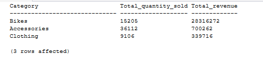

# PRODUCT CATEGORY ANALYSIS
Product category analysis examines the cost structure of the product portfolio to understand how average product costs vary across categories. This provides context for subsequent analysis of sales volume, revenue, and product performance.


## Average Cost by category
`Which product categories have the highest and lowest average product costs?`

The objective is to compare the average product cost across categories to identify differences in the cost structure of the product portfolio.


### Query
```sql
SELECT 
    coalesce(category, 'uncategorised') as Category,
    avg(cost) as Avg_cost
FROM gold.dim_products 
GROUP BY category
ORDER BY Avg_cost DESC;
```


### Query Result


### Key Insight
Bikes have the highest average product cost at **949**, substantially exceeding Components at **264**, while Accessories have the lowest average cost at **13**.

This indicates a substantial difference in the cost structure across product categories, with Bikes representing the most costly category on a per-product basis.

The significant variation in average product cost suggests that product categories may require different **inventory, pricing, and profitability strategies**.


## Sales Volume and Revenue by Category
`Which product categories generate the highest sales volume and which contribute the most revenue?`

The objective is to compare the number of units sold with revenue generated by each product category to identify categories that drive sales volume versus financial performance.


### SQL Query
```sql
SELECT 
    p.category AS Category,
    SUM(s.quantity) AS Total_quantity_sold,
    SUM(s.sales_amount) AS Total_revenue
FROM gold.fact_sales s
INNER JOIN gold.dim_products p
    ON s.product_key = p.product_key
GROUP BY p.category
ORDER BY Total_revenue DESC;
```


### Query Result



### Key Insight
The analysis reveals a clear difference between sales volume and revenue contribution as follows:

Accessories have the highest sales volume, with **36,112** units sold, but generate only **700,262** in revenue.
Bikes sell fewer units **(15,205)** than Accessories but generate an overwhelming **28,316,272** in revenue.
Clothing records the lowest sales volume **(9,106 units)** and contributes **339,716** in revenue.

This indicates that Accessories are the volume leader, while Bikes are the primary revenue-driving category.
