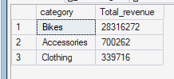
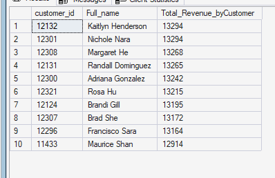

# REVENUE ANALYSIS
Revenue analysis evaluates the financial contribution of product categories and customers to identify the primary drivers of revenue and opportunities for commercial prioritisation.

## Total Revenue by Product Category
`Which product categories generate the most revenue, and how does their revenue contribution compare with sales volume?`

The objective is to identify which product categories contribute the most revenue and determine whether revenue performance aligns with sales volume.


### Query
```SQL 
SELECT 
    p.category,
    sum(s.sales_amount) Total_revenue
FROM gold.fact_sales s 
INNER JOIN gold.dim_products p
    ON s.product_key = p.product_key
GROUP BY p.category
ORDER BY Total_revenue DESC;
```


### Query Result



### Key Insight
Bikes dominate revenue generation with **28.32M (~96.5%)**, far exceeding Accessories **(0.70M) and Clothing (0.34M)**. This shows that revenue is heavily concentrated in the Bikes category, despite Accessories having the highest sales volume by quantity.


## Total Revenue by Customers
`Which customers generate the highest total revenue?`

The objective is to dentify the customers contributing the highest revenue to determine potential targets for customer retention and loyalty initiatives.


```sql
SELECT TOP 10
    c.customer_id,
    concat(c.first_name, ' ', c.last_name) Full_name,
    sum(s.sales_amount) as Total_Revenue_byCustomer
FROM gold.fact_sales s 
INNER JOIN gold.dim_customers c 
    ON s. customer_key = c.customer_key
GROUP BY c.customer_id, concat(c.first_name, ' ', c.last_name)
ORDER BY Total_Revenue_byCustomer DESC;
```


### Query Result



### Key Insight
The top 10 customers generated between **12,914 and 13,294** in revenue, with Kaitlyn Henderson and Nichole Nara jointly ranking highest at **13,294** each. These customers represent the highest-revenue customers within the analysed top-10 group and may warrant targeted retention and loyalty strategies.