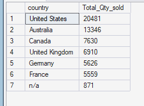
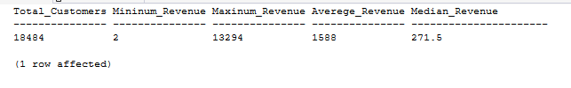

# DISTRIBUTION ANALYSIS
Distribution analysis examines how sales activity is spread across markets.

## Sales Volume Distribution by Country
`Which countries contribute the highest and lowest sales volume?`

The objective is determine how sales volume is distributed across countries and identify markets with relatively high or low unit sales.


### Query
```sql
SELECT 
    c.country,
    sum(s.quantity) Total_Qty_sold
FROM gold.fact_sales s 
INNER JOIN gold.dim_customers c 
    ON s. customer_key = c.customer_key
GROUP BY c.country
ORDER BY Total_qty_Sold DESC;
```


### Query Result



### Key Insight
The **United States leads in quantity sold with 20,481 units**, followed by Australia (**13,346**), while France records the lowest identified volume (**5,559**). This indicates that the U.S. and Australia are the strongest markets by sales volume. **The company should prioritize inventory and marketing investment in these markets while investigating strategies to improve performance in lower-volume countries.**


## Customer Revenue Distribution
`What are the minimum, maximum, average, and median revenue values generated per customer?`

The objective is to examine the distribution of revenue generated by individual customers to understand typical customer value and the variation between low- and high-revenue customers.

### Query
```sql
WITH Customer_Revenue_Base AS (
    SELECT 
         c.customer_id,
         SUM(s.sales_amount) AS Total_Revenue
         FROM gold.fact_sales s
         INNER JOIN gold.dim_customers c
            ON s.customer_key = c.customer_key
         GROUP BY customer_id
),
Customer_Revenue_With_Median AS (
    SELECT
        customer_id,
        Total_Revenue,
        PERCENTILE_CONT(0.5) WITHIN GROUP (ORDER BY Total_Revenue) OVER() AS Median_Revenue
    FROM Customer_Revenue_Base
)

SELECT
    COUNT(DISTINCT customer_id) AS Total_Customers,
    MIN(Total_Revenue) AS Mininum_Revenue,
    MAX(Total_Revenue) AS Maxinum_Revenue,
    AVG(Total_Revenue) AS Averege_Revenue,
    MAX(Median_Revenue) AS Median_Revenue
FROM Customer_Revenue_With_Median;
```

### Query Result



### Key Insight
Revenue contribution varies substantially across the **18,484** customers, ranging from **2 to 13,294**.

An interesting difference between the average customer revenue of **1,588 and the median of 271.5** was found. The average is considerably higher than the median, indicating a right-skewed customer revenue distribution, where a smaller group of higher-revenue customers contributes disproportionately to overall sales.

This means the average revenue alone does not represent the purchasing behaviour of the typical customer.