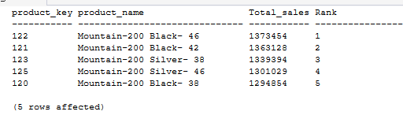
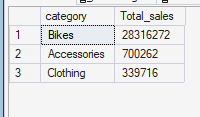

# RANKING ANALYSIS
Ranking analysis identifies the highest-performing products and categories based on revenue, helping the business understand where revenue is concentrated and where commercial attention should be prioritised.
It enables identification of top performers


## Top Revenue Generating Products
`Which individual products generate the highest total revenue?`

This identifies the products generating the highest revenue and determine whether revenue is concentrated among a small number of products.


### Query
```sql 
SELECT
    *
FROM (
    SELECT
    TOP 5
	    s.product_key,
	    p.product_name,
	    SUM(s.sales_amount)  as Total_sales,
	    ROW_NUMBER() over(order by sum(s.sales_amount) DESC) as Rank
	FROM gold.fact_sales s 
    LEFT JOIN gold.dim_products p
	    ON s.product_key = p.product_key
	GROUP BY s.product_key, p.product_name
)t
WHERE Rank <= 5;
```


### Query Result



### Key Insight
The **Mountain-200** product line dominates the top 5 revenue-generating products, with sales ranging from **1.29M to 1.37M**. This strong concentration suggests the company should `prioritize inventory availability, marketing, and promotional efforts around the Mountain-200 line while monitoring dependence on these high-performing products`.
However, the company should avoid excessive dependence on a small group of products by monitoring the performance of other product lines and developing opportunities to diversify revenue.


## Top Product Categories
`Which product categories generate the highest total revenue?`

This rank product categories by revenue to identify the categories making the largest financial contribution to the business.


### Query
```sql
SELECT
    category,
    Total_sales
FROM (
    SELECT
        p.category,
        sum(s.sales_amount)  AS Total_sales,
        ROW_NUMBER() OVER(ORDER BY sum(s.sales_amount)DESC) AS Rank
    FROM gold.fact_sales s 
    LEFT JOIN gold.dim_products p
        ON s.product_key = p.product_key
    GROUP BY p.category
)t
WHERE Rank <= 5
ORDER BY Total_sales DESC;
```


### Query Result



### Key Insight
**Bikes overwhelmingly dominate category revenue at 28.32M**, compared with 0.70M for Accessories and **0.34M** for Clothing. The result highlights a strong dependence on Bikes for revenue generation, suggesting the company should **protect bike inventory and sales while exploring opportunities to grow the lower-performing categories**.
